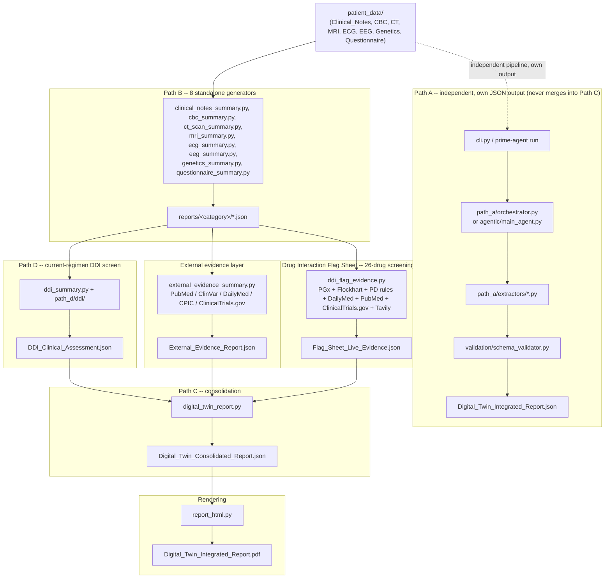

# Prime Agent — Patient Digital Twin Report Generator

> Synthetic-data research/engineering project — every source file is labelled `SYNTHETIC TEST DATA - NOT A REAL MEDICAL RECORD`. This is not a medical device and does not provide medical advice.

## 1. Overview

Prime Agent turns a patient's raw medical files — clinical notes, CBC labs, CT/MRI, ECG, EEG, a genetics spreadsheet, a questionnaire — into a validated, machine-readable **Digital Twin JSON** and a polished, doctor-facing **PDF report**.

On top of that, the system makes real, live calls to public biomedical APIs — PubMed, ClinVar, DailyMed, CPIC, ClinicalTrials.gov, and (as a general-web fallback/co-source) Tavily — for two different purposes:

1. **External evidence for the patient's own current drugs and genes** (`external_evidence_summary.py`) — citations, variant classifications, and guideline lookups for what this specific patient is actually taking and what their genetics panel actually found.
2. **A drug-drug interaction (DDI) screening panel** (`ddi_flag_evidence.py`) — every unique pair across a curated ~26-drug list (the patient's current regimen plus clinically relevant candidates drawn from their own genetics panel) is checked against up to six evidence sources and classified **Positive Impact** or **Negative Impact**, feeding the report's Drug Interaction Flag Sheet.

Every part of this codebase is built around one non-negotiable rule: **never invent a value.** If a fact isn't explicitly present in the source data, or isn't something a live API actually returned, the output says so explicitly — `null`, `"Not available"`, `"UNRESOLVED"`, or a pair simply doesn't appear in the Flag Sheet — rather than guessing, estimating, or presenting a plausible-looking placeholder as if it were real.

## 2. Architecture



The dashed arrow marks Path A as a separate, independent track: it reads the same `patient_data/` but writes its own file (`reports/Digital_Twin_Integrated_Report.json`) and never feeds into Path C's consolidation. Path B's outputs feed **three** parallel additive layers — Path D (the current regimen's own DDI screen), the external evidence layer (citations for current drugs/genes), and the Drug Interaction Flag Sheet (a much wider 26-drug screening panel) — all three of which merge into Path C, which feeds the PDF renderer.

**Path D vs. the Drug Interaction Flag Sheet — two different DDI pipelines, not duplicates:**

| | Path D (`ddi_summary.py`) | Drug Interaction Flag Sheet (`ddi_flag_evidence.py`) |
|---|---|---|
| Scope | Only the patient's **actual current regimen** pairs | A curated **~26-drug screening panel** (current regimen + clinically relevant candidates from the patient's own 44-drug genetics panel) — 325 unique pairs |
| Sources | Bundled CYP450 reference table + clinical/EEG/ECG/CBC context | Up to 6 sources per pair, in strict priority order (see section 5) |
| Output | `reports/ddi/DDI_Clinical_Assessment.json` — full clinical-context severity assessment | `reports/drug_interaction_flags/Flag_Sheet_Live_Evidence.json` — Positive/Negative Impact per pair |
| Report section | "Drug Interactions" (06) | "Drug Interaction Flag Sheet — Extracted Drug List" (per-drug Positive/Negative tables) |

The same flow, as five short stages (for viewers without Mermaid support — every line stays narrow, nothing depends on wide column alignment):

```
STAGE 1 -- Source data
  patient_data/  ->  Clinical Notes, CBC, CT, MRI, ECG, EEG, Genetics, Questionnaire

STAGE 2 -- Path B: one parser per category (run first)
  clinical_notes_summary.py, cbc_summary.py, ct_scan_summary.py, mri_summary.py,
  ecg_summary.py, eeg_summary.py, genetics_summary.py, questionnaire_summary.py
  ->  reports/<category>/*.json

  (Path A runs independently, any time -- same source files, its own separate
  output at reports/Digital_Twin_Integrated_Report.json, never merges below.
  Entry point: cli.py / prime-agent run.)

STAGE 3 -- Three parallel evidence layers, each reading Stage 2's output
  a. Path D (current regimen only)        ddi_summary.py
                                           ->  DDI_Clinical_Assessment.json
  b. External evidence (current drugs     external_evidence_summary.py
     + genes)                             ->  External_Evidence_Report.json
  c. Drug Interaction Flag Sheet          ddi_flag_evidence.py
     (26-drug / 325-pair screening)       ->  Flag_Sheet_Live_Evidence.json

STAGE 4 -- Path C: consolidation
  digital_twin_report.py merges every Path B report + Path D + external
  evidence + the Flag Sheet, verbatim
  ->  reports/Digital_Twin_Consolidated_Report.json

STAGE 5 -- Rendering
  report_html.py  ->  reports/Digital_Twin_Integrated_Report.pdf
  (HTML -> headless Microsoft Edge --print-to-pdf -> reportlab/pypdf overlay)
```

The **external evidence layer** and the **Drug Interaction Flag Sheet** both sit on top of the same shared toolkit (`patient_prime_agent/external_lookup/`) — every live lookup goes through the same four stages before a result ever reaches a report:

```
TOOLS                  GUARDRAILS               OBSERVABILITY              MEMORY
pubmed_lookup.py        guardrails.py             http_client.py's           memory_store.py
clinvar_lookup.py       validate_query_term()      classify_error() /        recall_or_compute():
dailymed_lookup.py      -- input allowlist,        ERROR_STATUSES --         30-day TTL, keyed by
cpic_lookup.py          drug/gene names only,      rate_limited /            (source, normalized
trials_lookup.py        never notes/patient text   network_error /           term); a fresh recall
search_tools.py            |                       http_error /              replays the ORIGINAL
(Tavily)                   v                       invalid_response          finding + date, never
   |                   sanitize_response_field() + build_envelope()          a new live call
   v                    validate_source_url()      every result carries         |
real HTTP GET  ------>  -- strips HTML/scripts,    status / retrieved_at /       v
via http_client.py      truncates, confirms each    from_cache / verification  reports/external_lookup/
(rate-limited,          URL matches its real source  -- never a bare "error"   memory/memory_store.json
on-disk cached,
retried once)
```

## 3. Data flow (real files, in order)

1. **`patient_data/`** — one folder per category, raw source files (PDFs, `.xlsx`, `.edf`/`.mat`/`.nii` + accompanying pre-computed `*_summary.json`, `.png`).
2. **Path B generators** run first, one per category: `clinical_notes_summary.py`, `cbc_summary.py`, `ct_scan_summary.py`, `mri_summary.py`, `ecg_summary.py`, `eeg_summary.py`, `genetics_summary.py`, `questionnaire_summary.py`. Each parses its category's real file format in depth and writes to `reports/<category>/*.json`.
3. **Path D** (`ddi_summary.py`) reads the current medication regimen out of `clinical_notes`'s own output and cross-references it against `genetics`, `eeg`, `ecg`, and `cbc` — all already-generated Path B outputs — writing `reports/ddi/DDI_Clinical_Assessment.json`.
4. **The external evidence layer** (`external_evidence_summary.py`) reads the same current-regimen drug names (via `path_d.ddi.normalizer.normalize_regimen`) and the gene-drug pairs from `genetics`'s findings, makes live API calls per drug/pair, and writes `reports/external_evidence/External_Evidence_Report.json`.
5. **The Drug Interaction Flag Sheet** (`ddi_flag_evidence.py`) reads the same current regimen, merges it with a curated ~24-drug candidate panel (`path_d/ddi/candidate_drugs.py`), generates all unique pairs (326 drugs → 325 pairs today), and classifies each pair Positive/Negative per the priority-ordered rules in section 5 — writing `reports/drug_interaction_flags/Flag_Sheet_Live_Evidence.json`.
6. **Path C** (`digital_twin_report.py`) merges every Path B report, Path D's DDI screen, the external evidence report, and the Flag Sheet — verbatim, byte-for-byte, via its `SOURCE_REPORTS` tuple — into `reports/Digital_Twin_Consolidated_Report.json`. A source that hasn't been generated yet is simply omitted (listed in `source_manifest.sections_missing`), never faked.
7. **`report_html.py`** reads that consolidated JSON and renders `reports/Digital_Twin_Integrated_Report.pdf` — cover + numbered sections, including the Drug Interactions (06), Pharmacogenomics (07), and Drug Interaction Flag Sheet sections.

**Path A** (`cli.py` / `prime-agent run` → `path_a/orchestrator.py` or `agentic/main_agent.py` → `path_a/extractors/*.py` → `validation/schema_validator.py`) runs independently of B/C/D — same source files, a different generic 6–12-field-per-category extraction, written to a separate file (`reports/Digital_Twin_Integrated_Report.json`), so it can never clobber the Path B/C/D outputs.

## 4. External evidence layer (current drugs and genes)

`patient_prime_agent/external_lookup/` makes real, live HTTP calls — never reused static data presented as if it were live-verified — to public biomedical APIs, for the patient's own current-regimen drugs and the gene-drug pairs their own genetics panel links to those drugs:

| Module | Source | What it looks up |
| --- | --- | --- |
| `pubmed_lookup.py` | PubMed (NCBI E-utils, `esearch`+`esummary`) | Citations by drug, gene, or a combined `"GENE AND DRUG"` / `"DrugA AND DrugB"` query |
| `clinvar_lookup.py` | ClinVar (NCBI E-utils, `db=clinvar`) | Variant records by gene symbol — classification, review status, linked traits |
| `dailymed_lookup.py` | DailyMed (NLM REST API v2) | Structured Product Labels by drug name, plus (see section 5) the label's own real Drug Interactions section text |
| `cpic_lookup.py` | CPIC (`api.cpicpgx.org`, PostgREST) | Whether CPIC has assessed a specific gene-drug pair, its evidence level, and any active dosing guideline |
| `trials_lookup.py` | ClinicalTrials.gov (API v2) | Studies matching the patient's condition, or a drug pair, structurally confirmed (not just keyword-matched) to list what was actually searched for |
| `search_tools.py` | Tavily (general web search) | General web results — **fallback only** here: only called after every medical source above has genuinely returned `no_results` for the same query. In the Drug Interaction Flag Sheet (section 5) it is used differently — called unconditionally, but always labeled "General web search (Tavily)" and always lowest priority |

**In scope**: the sources above. **Out of scope**, per the NeuroTwin resource guide this layer was built against (recorded verbatim in `external_evidence_summary.py`'s own `_OUT_OF_SCOPE_RESOURCES` and re-stated in every PDF evidence card's "Known Limitations" block): ChEMBL, IUPHAR/BPS Guide to Pharmacology, Open Targets, BindingDB, DrugBank, Reactome, STRING, BioGRID, PharmGKB, GTEx Portal, RCSB PDB, AlphaFold DB, RxNorm, SNOMED CT/HPO, and ~15 others. A missing resource is never inferred from what this layer *does* return.

**Guardrails** (`guardrails.py`), enforced on every module:
- **Input**: `validate_query_term()` — an allowlist regex (letters/digits/hyphens/spaces, ≤60 chars) run before any URL is built, so notes text, a patient name, or an ID can never reach a public API as a query term. Fails closed (raises `QueryValidationError`).
- **Output**: `sanitize_response_field()` strips HTML/script content and truncates; `validate_source_url()` confirms every returned URL actually belongs to the domain it claims to (rejecting, e.g., a spoofed `pubmed.ncbi.nlm.nih.gov.evil.com`). A field that fails degrades to empty/`None`, never breaking the whole lookup.

**Observability**: `http_client.py`'s `classify_error()` sorts every failure into `ERROR_STATUSES` — `rate_limited`, `network_error`, `http_error`, `invalid_response` — instead of one generic `"error"`, so a 429 is always distinguishable from a genuine outage. Every result envelope carries `status`, `retrieved_at`, `from_cache`, and (once memory is involved) `verification` (`"live"`/`"cached"`). `report_html.py` surfaces all of this directly: an `UNRESOLVED` badge for missing/failed coverage (never presented as a clean negative), a `LIVE`/`CACHED` badge, and a provenance line (resource, record ID, version, retrieval date) on every finding.

**Caching / memory** — two independent layers:
1. `http_client.py`'s on-disk response cache (`reports/external_evidence/.cache/`, keyed by the exact request URL's SHA-256, no expiry) — avoids re-issuing an identical HTTP call.
2. `memory_store.py`'s long-term memory (`reports/external_lookup/memory/memory_store.json`, keyed by `(source, normalized term)`, **30-day TTL**) — the higher-level "have we already looked this up recently" layer. A fresh recall replays the original finding with its original retrieval date; an expired or corrupted store degrades cleanly to a live call, never a crash.

## 5. Drug Interaction Flag Sheet (26-drug screening panel)

`ddi_flag_evidence.py` is a separate, wider screening pass than Path D: instead of only the patient's actual current-regimen pairs, it checks **every unique pair** across a curated ~26-drug panel — the real current regimen (`Lamotrigine`, `Levetiracetam`) plus `path_d/ddi/candidate_drugs.py`'s curated candidate list, itself drawn only from drugs the patient's own 44-drug genetics panel actually covers. Today that's 325 pairs.

**Classification rules live in `skills/patient_prime_agent/ddi-therapeutic-response/SKILL.md`** — a rules-only reference document (no drug names, no patient data) covering the single-drug 4-category response system, how drug-drug interactions mechanistically happen, when two drugs' PGx findings may be combined into one pair verdict, and the full evidence-source priority order. That file is the spec; `ddi_flag_evidence.py` is the implementation.

**Priority order per pair — never skip ahead once a source resolves it:**

1. **Patient's own PGx findings**, only when the two drugs' genetics-panel rows genuinely share a gene or a confirmed enzyme relationship (never merged just because both drugs happen to have *some* PGx row).
2. **Curated pharmacology sources** — Flockhart's CYP-pathway table and pharmacodynamic class rules (`path_d/ddi/reference_data.py`, `pharmacodynamic_rules.py` — small, intentionally static, hand-curated tables), plus a **live** DailyMed check per drug (`dailymed_lookup.fetch_label_interactions_section` — the real FDA label's own Drug Interactions section text, checked for whether the other drug is genuinely named in it). None of these four can resolve a pair as Positive on their own — only Negative, or nothing.
3. **Literature fallback** — a combined PubMed query (`pubmed_lookup.search_pubmed_drug_pair`) and a combined ClinicalTrials.gov query (`trials_lookup.search_trials_drug_pair`, structurally confirmed both drugs are real interventions, not just keyword-matched), then Tavily (`search_tools.search_tavily`) — called unconditionally alongside the other three, always labeled `"General web search (Tavily)"`, always lowest priority.
4. **A candidate whose own text doesn't clearly resolve Positive/Negative is skipped, not forced into a verdict** — the next candidate in priority order is checked instead. If nothing ever resolves the pair, it is **excluded from the report entirely**, the same as a pair with zero evidence. There is no third "needs review" column.

Every classified pair is tagged with a `primary_evidence_label` (which specific source actually resolved it — not necessarily the highest-priority one that merely *returned something*) and full `evidence_labels` provenance, so `report_html.py`'s hyperlink always points to, and is captioned by, the source that actually produced the Finding.

Current real numbers (26 drugs, 325 pairs checked): **146 resolve** (64 Positive / 82 Negative), **179 are unresolved and excluded**. Per-source hit counts: PubMed 87, DailyMed 59, ClinicalTrials.gov 129, Tavily 146 (always fires — general web search almost always returns *something*, but it's the lowest-priority, distinctly-labeled candidate).

```powershell
python -m patient_prime_agent.ddi_flag_evidence                 # run the full screening panel
python -m patient_prime_agent.ddi_flag_evidence --refresh        # bypass the 30-day cache, re-query everything
python -m patient_prime_agent.ddi_flag_evidence --dedupe-existing  # one-time cleanup: remove any duplicate
                                                                    # pair entries from an already-written output
```

## 6. How to run it

### Setup

```powershell
python -m venv .venv
.\.venv\Scripts\Activate.ps1
python -m pip install --upgrade pip
python -m pip install -e .
```

Core install (`pypdf`, `openpyxl`, `reportlab`) runs every Path A/B/C/D generator and the external evidence layer with the LLM disabled. Optional extras: `.[llm]` (Hugging Face `transformers`, for the agent runtime's advisory narration), `.[quant]` (4-bit, CUDA only), `.[test]` (pytest). PDF rendering (`report_html.py`) additionally requires **Microsoft Edge** installed (Windows).

Copy `.env.example` to `.env` if you want the Drug Interaction Flag Sheet's Tavily fallback/co-source enabled — set your own `TAVILY_API_KEY`; leave it unset and `search_tools.py` reports `status="missing_api_key"` rather than silently skipping it, so PubMed/DailyMed/ClinicalTrials.gov keep working with no key at all.

### Manual path (B → D → external evidence → Flag Sheet → C → render)

```powershell
python -m patient_prime_agent.clinical_notes_summary
python -m patient_prime_agent.cbc_summary
python -m patient_prime_agent.ct_scan_summary
python -m patient_prime_agent.mri_summary
python -m patient_prime_agent.ecg_summary
python -m patient_prime_agent.eeg_summary
python -m patient_prime_agent.genetics_summary
python -m patient_prime_agent.questionnaire_summary

python -m patient_prime_agent.ddi_summary
python -m patient_prime_agent.external_evidence_summary   # add --refresh to bypass caches/memory
python -m patient_prime_agent.ddi_flag_evidence            # add --refresh to bypass caches/memory

python -m patient_prime_agent.digital_twin_report
python -m patient_prime_agent.report_html
```

Run `clinical_notes_summary` and `genetics_summary` before Path D / the Flag Sheet (both read their output); run at least one Path B category before Path C (it only merges what already exists, and omits the rest). Each step's `--input`/`--output` flags override its defaults.

### Automated path (Path A)

```powershell
python -m patient_prime_agent                 # legacy harness, no agent runtime
python -m patient_prime_agent --agentic        # same output, driven by the agent runtime
prime-agent run                                # equivalent to the line above
prime-agent status                             # runtime / harness / model / refinement status
```

## 7. Testing

```powershell
python -m pytest                 # fast suite (default) -- excludes the one live-network test
python -m pytest -m slow         # the one excluded test: fires a real concurrent burst at NCBI
```

**395 tests, all passing**, across 21 files:

| File | Count | Covers |
| --- | --- | --- |
| `test_report_html_ddi_therapy.py` | 43 | Drug Interaction Flag Sheet + Therapy-Level rendering: 2-column Positive/Negative tables, per-drug point-of-view, hyperlink anchor text matching the real resolving source |
| `test_external_lookup.py` | 38 | Per-API response parsing against real captured response shapes, on-disk cache, pair-query builders, dedup guards |
| `test_ddi_flag_evidence.py` | 33 | Screening-panel pairing/dedup, priority-order classification and fall-through, retraction handling, `dedupe_pairs_output`, `build_report` integration |
| `test_memory_refinement.py` | 27 | Agent memory CRUD/versioning, refinement target classification, rollback |
| `test_model_loader.py` | 27 | Config resolution, hardware detection, device/dtype/4-bit selection, model tiering |
| `test_harness_crud.py` | 22 | Continual harness component CRUD, revisions, rollback |
| `test_search_tools.py` | 21 | Tavily backend: unified envelope shape, missing-key handling, medical-fallback gate |
| `test_integration.py` | 20 | Full seven-phase Path A run, report validity, traceability, CLI |
| `test_external_evidence_resource_router.py` | 19 | Resource routing across the external evidence layer's question-answering paths |
| `test_persistent_subagents.py` | 18 | One agent per category, extractor reuse, evidence traceability |
| `test_schema_validation.py` | 18 | Schema defaults, type/required/date rejection, repair behaviour |
| `test_report_html_external_evidence.py` | 18 | Evidence-card rendering: no double-escaping, no mid-word truncation, gene-wide ClinVar labeling |
| `test_ddi_external_evidence.py` | 16 | Current-regimen pair-level PubMed evidence folded into therapy assessments |
| `test_rlm_delegation.py` | 16 | Agent registration, delegation, retry budget, state persistence |
| `test_external_lookup_sanitization.py` | 15 | Output guardrails: HTML/script stripping, truncation, URL domain validation |
| `test_external_lookup_memory.py` | 12 | Long-term memory: store/recall, TTL expiry, corrupted-store fallback, badge propagation |
| `test_a2a.py` | 11 | A2A message bus, correlation, persistence |
| `test_external_lookup_guardrails.py` | 8 | Input guardrail: valid term passes, notes-like text rejected before any HTTP call |
| `test_ddi.py` | 6 | Regimen normalization, dose-conflict detection, no invented drugs/severity |
| `test_report_html_section_order.py` | 6 | Consolidated-report section ordering in the rendered PDF/HTML |
| `test_external_lookup_ratelimit.py` | 1 fast + 1 `slow` | Fast: error-vocabulary sanity check. Slow (excluded by default): a real concurrent burst against NCBI, confirming a genuine 429 degrades cleanly with a distinguishable reason |

**Automated**: Path A (agent runtime + legacy harness), Path D (`ddi_summary.py`), the entire external evidence layer, and the entire Drug Interaction Flag Sheet (`ddi_flag_evidence.py` + its rendering in `report_html.py`) — every live source is mocked in tests, and Tavily is never called for real unless a test explicitly opts in with a fake key.

**Manually verified, not covered by automated tests**: the 8 Path B standalone generators, Path C (`digital_twin_report.py`), and the rest of `report_html.py`'s sections beyond the evidence cards and Flag Sheet — verified by rendering and visually reviewing every page during development, but with no `tests/` entries for that logic. This is a real, acknowledged gap.

## 8. Known limitations

- **Path B and Path C have no full automated test coverage.** Only `report_html.py`'s external-evidence cells and the Flag Sheet are covered; the other 8 generators and the consolidation step are manually verified.
- **The external evidence layer covers exactly five medical APIs plus Tavily.** The rest of the NeuroTwin resource catalog (~25 more resources — PharmGKB, DrugBank, Reactome, STRING, GTEx, RCSB PDB, etc.) is out of scope and must not be inferred from what these return (see section 4).
- **A `no_results`/unresolved status is not evidence of absence.** It means this exact query returned nothing (or didn't clearly resolve) at the time checked — the report says so explicitly rather than presenting it as a clean negative. This applies to both the external evidence layer (`UNRESOLVED` badge) and the Flag Sheet (pair simply excluded, not shown as "no concern").
- **The Flag Sheet's silent-exclusion-vs-labeled-Unresolved tradeoff is an open, undecided product question**, flagged explicitly in `skills/patient_prime_agent/ddi-therapeutic-response/SKILL.md` Part 4 — an excluded pair reads as "nothing to worry about" when the true state is "nothing was found or nothing resolved clearly." Removing the report's earlier 3-way (Positive/Negative/Needs Review) classification dropped resolved-pair coverage from 325/325 to 146/325 on the current dataset — a real, measured tradeoff of favoring "never guess" over "always show something."
- **Two of the Flag Sheet's five source tiers are intentionally static, hand-curated reference tables** (the Flockhart CYP-pathway table and the pharmacodynamic class-interaction rules), not live queries — by design, matching how a real curated pharmacology reference works in practice.
- **CPIC's guideline content now lives on `clinpgx.org`**, not `cpicpgx.org` (the API host) — CPIC's knowledge base was rebranded to "ClinPGx" mid-project; both domains are accepted (`CPIC_GUIDELINE_DOMAINS` in `guardrails.py`), confirmed against a live call during development.
- **NCBI rate-limiting is concurrency-sensitive, not just rapidity-sensitive** — a sequential burst of 60 rapid calls did not reliably trigger a 429 in testing, but a concurrent burst of 20 reliably did. The `slow`-marked rate-limit test is excluded from the default suite because live third-party throttling isn't deterministic run to run.
- **`priority_safety_flags`** in the genetics report is a keyword- and significance-driven candidate list, not a clinically validated ranking.
- **The CT generator's findings text comes from a curated filename→findings lookup table**, not real image analysis — there is no radiology model in this codebase.
- **`.mat`, `.edf`, and `.nii` files are never parsed directly** — every EEG/ECG/MRI generator relies on an accompanying pre-computed `*_summary.json`/`*_preprocess_data/*.json` file.
- **Path D's CYP450 reference table covers only the drugs seen in this dataset's regimen**, not a general drug database; a drug outside it is reported `unresolved`, never confirmed-safe. Its SuperCYPsPred adapter is stubbed and always reports "not evaluated locally."
- **`report_html.py` requires Microsoft Edge** at a standard Windows path (or on `PATH` as `msedge`); it does not run headless PDF rendering on non-Windows platforms as written.
- **4-bit quantization requires CUDA + `bitsandbytes`**; on CPU-only machines the agent runtime's advisory LLM (if enabled) always runs in `float32`.
- **A ClinicalTrials.gov link that opens fine when pasted into a browser but 403s when clicked from inside a PDF viewer** is a bot-protection quirk on ClinicalTrials.gov's end (embedded PDF viewers route through a different network context than a real browser tab) — not a bug in the generated URL. Open the PDF in an actual browser, not an embedded viewer, if this happens.

## 9. Project structure

```
patient_prime_agent/
|-- agentic/                      # Prime Agent runtime (drives Path A): a2a.py, cli.py, harness.py,
|   |                              #   llm.py, main_agent.py, memory.py, model_loader.py, refine.py,
|   |                              #   runtime.py, session.py, settings.py, subagents.py
|-- core/                         # config.py (ProjectPaths, CATEGORY_ORDER), models.py, utils.py
|-- external_lookup/               # live external-evidence layer -- see section 4
|   |-- clinvar_lookup.py, cpic_lookup.py, dailymed_lookup.py, pubmed_lookup.py, trials_lookup.py
|   |-- search_tools.py           #   Tavily general-web-search backend, shared by both DDI layers
|   |-- guardrails.py, http_client.py, memory_store.py
|-- path_a/                       # Path A engine: planner.py, orchestrator.py, file_tools.py,
|   |                              #   memory_store.py, refinement.py, report_builder.py, skill_store.py
|   |-- extractors/               #   one schema-validated extractor per category
|   +-- skills/                   #   SKILL.md per category (Path A's own runtime skills)
|-- path_d/
|   +-- ddi/                      # Path D + Flag Sheet shared engine: normalizer.py, pairing.py,
|                                  #   reference_data.py, pharmacodynamic_rules.py, pgx_modifiers.py,
|                                  #   clinical_context.py, aggregation.py, severity.py,
|                                  #   candidate_drugs.py (Flag Sheet's curated 26-drug panel)
|-- validation/                   # schema_validator.py, repair.py
|-- __init__.py, __main__.py, cli.py
|-- cbc_summary.py, clinical_notes_summary.py, ct_scan_summary.py, mri_summary.py,   # Path B
|   ecg_summary.py, eeg_summary.py, genetics_summary.py, questionnaire_summary.py    # (8 generators)
|-- ddi_summary.py                # Path D entry point (current-regimen DDI screen)
|-- ddi_flag_data.py              # curated Green-Flags/Red-Flags reference data (report_html.py, build_flags_table.py)
|-- ddi_flag_evidence.py          # Drug Interaction Flag Sheet entry point -- see section 5
|-- external_evidence_summary.py  # external evidence layer entry point -- see section 4
|-- digital_twin_report.py        # Path C entry point
+-- report_html.py                # PDF rendering entry point

skills/patient_prime_agent/ddi-therapeutic-response/SKILL.md   # DDI classification rules spec -- see section 5
tests/          # 21 files, 395 tests -- see section 7
schemas/        # one *.schema.json per category + digital_twin_report.schema.json
patient_data/   # source files, one folder per category
reports/        # every generated output (per-category JSON, DDI, external evidence, Flag Sheet, consolidated JSON, PDF)
memory/         # legacy + agentic persistent state (harness state, sessions, A2A logs, agent memory)
```

Every module invoked as `python -m patient_prime_agent.<name>` (all of Path B, `ddi_summary.py`, `external_evidence_summary.py`, `ddi_flag_evidence.py`, `digital_twin_report.py`, `report_html.py`) stays at the package root by design — these are the project's documented, script-referenced entry points, and moving them into a subpackage would break that exact invocation. `cli.py` and `agentic/` also stay at the root: both are registered `[project.scripts]` console-script targets (`prime-patient-agent`, `prime-agent`) and `cli.py` is `__main__.py`'s direct import target.
