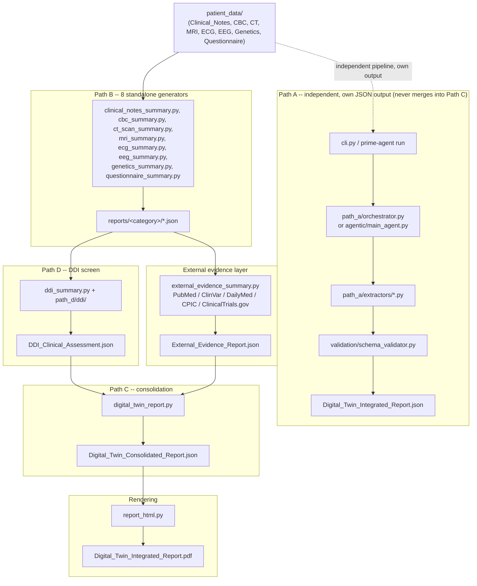

# Prime Agent — Patient Digital Twin Report Generator

> Synthetic-data research/engineering project — every source file is labelled `SYNTHETIC TEST DATA - NOT A REAL MEDICAL RECORD`. This is not a medical device and does not provide medical advice.

## 1. Overview

Prime Agent turns a patient's raw medical files — clinical notes, CBC labs, CT/MRI, ECG, EEG, a genetics spreadsheet, a questionnaire — into a validated, machine-readable **Digital Twin JSON** and a polished, doctor-facing **PDF report**. The system also makes real, live calls to five public biomedical APIs (PubMed, ClinVar, DailyMed, CPIC, ClinicalTrials.gov) to attach independent, external evidence for the patient's actual current drugs and genes.

Every part of this codebase is built around one non-negotiable rule: **never invent a value.** If a fact isn't explicitly present in the source data (or, for the external evidence layer, isn't something a live API actually returned), the output says so explicitly — `null`, `"Not available"`, `"UNRESOLVED"`, or a "not retrieved in this session" note — rather than guessing, estimating, or presenting a plausible-looking placeholder as if it were real.

## 2. Architecture



The dashed arrow marks Path A as a separate, independent track: it reads the same `patient_data/` but writes its own file (`reports/Digital_Twin_Integrated_Report.json`) and never feeds into Path C's consolidation. Path B's outputs are the ones that continue on into Path D and the external evidence layer, which both merge into Path C, which feeds the PDF renderer.

The same flow, as plain text (for viewers without Mermaid support):

```
patient_data/
(Clinical_Notes, CBC, CT, MRI, ECG, EEG, Genetics, Questionnaire)
   |
   |---------------------------------------------------------------+
   |                                                                |
   v                                                                v
PATH A -- schema-validated pipeline                    PATH B -- standalone category generators
(parallel, independent output)                          (deep, category-native parsing)
cli.py / prime-agent run                                 cbc_summary.py, clinical_notes_summary.py,
  -> path_a/orchestrator.py  or  agentic/main_agent.py    ct_scan_summary.py, mri_summary.py,
  -> path_a/extractors/*.py                               ecg_summary.py, eeg_summary.py,
  -> validation/schema_validator.py + repair.py            genetics_summary.py, questionnaire_summary.py
  -> reports/Digital_Twin_Integrated_Report.json
                                                              |
                                                              v
                                                    reports/<category>/*.json
                                                              |
                                    +-------------------------+-------------------------+
                                    |                                                   |
                                    v                                                   v
                        PATH D -- DDI screen (additive)                EXTERNAL EVIDENCE LAYER
                        ddi_summary.py + path_d/ddi/                    external_evidence_summary.py
                        reads current regimen (from clinical_notes)     queries PubMed / ClinVar / DailyMed /
                        + genetics/EEG/ECG/CBC outputs, plus a          CPIC / ClinicalTrials.gov for the
                        bundled CYP450 reference table                 patient's actual current-regimen
                                    |                                   drugs + gene-drug pairs
                                    v                                              |
                        reports/ddi/DDI_Clinical_Assessment.json                  v
                                    |                          reports/external_evidence/External_Evidence_Report.json
                                    |                                              |
                                    +-------------------------+-------------------+
                                                              |
                                                              v
                                              PATH C -- consolidation
                                              digital_twin_report.py (SOURCE_REPORTS)
                                              merges all Path B outputs + Path D + the
                                              external evidence report, verbatim
                                                              |
                                                              v
                                    reports/Digital_Twin_Consolidated_Report.json
                                                              |
                                                              v
                                              RENDERING -- report_html.py
                                              HTML (navy/teal CSS, inline SVG charts)
                                                -> headless Microsoft Edge --print-to-pdf
                                                -> reportlab/pypdf header/footer/page overlay
                                                              |
                                                              v
                                    reports/Digital_Twin_Integrated_Report.pdf
```

The **external evidence layer** (`patient_prime_agent/external_lookup/`) is itself a small pipeline — every one of the five live lookups goes through the same four stages before a result ever reaches a report:

```
TOOLS                  GUARDRAILS               OBSERVABILITY              MEMORY
pubmed_lookup.py        guardrails.py             http_client.py's           memory_store.py
clinvar_lookup.py       validate_query_term()      classify_error() /        recall_or_compute():
dailymed_lookup.py      -- input allowlist,        ERROR_STATUSES --         30-day TTL, keyed by
cpic_lookup.py          drug/gene names only,      rate_limited /            (source, normalized
trials_lookup.py        never notes/patient text   network_error /           term); a fresh recall
   |                        |                       http_error /              replays the ORIGINAL
   v                        v                       invalid_response          finding + date, never
real HTTP GET  ------>  sanitize_response_field() + build_envelope()          a new live call
via http_client.py      validate_source_url()      every result carries         |
(rate-limited,          -- strips HTML/scripts,    status / retrieved_at /       v
on-disk cached,         truncates, confirms each    from_cache / verification  reports/external_lookup/
retried once)           URL matches its real source  -- never a bare "error"   memory/memory_store.json
```

## 3. Data flow (real files, in order)

1. **`patient_data/`** — one folder per category, raw source files (PDFs, `.xlsx`, `.edf`/`.mat`/`.nii` + accompanying pre-computed `*_summary.json`, `.png`).
2. **Path B generators** run first, one per category: `clinical_notes_summary.py`, `cbc_summary.py`, `ct_scan_summary.py`, `mri_summary.py`, `ecg_summary.py`, `eeg_summary.py`, `genetics_summary.py`, `questionnaire_summary.py`. Each parses its category's real file format in depth and writes to `reports/<category>/*.json`.
3. **Path D** (`ddi_summary.py`) reads the current medication regimen out of `clinical_notes`'s own output and cross-references it against `genetics`, `eeg`, `ecg`, and `cbc` — all already-generated Path B outputs — writing `reports/ddi/DDI_Clinical_Assessment.json`.
4. **The external evidence layer** (`external_evidence_summary.py`) reads the same current-regimen drug names (via `path_d.ddi.normalizer.normalize_regimen`) and the gene-drug pairs from `genetics`'s findings, makes five live API calls per drug/pair, and writes `reports/external_evidence/External_Evidence_Report.json`.
5. **Path C** (`digital_twin_report.py`) merges the 8 Path B reports, Path D's DDI screen, and the external evidence report — verbatim, byte-for-byte, via its `SOURCE_REPORTS` tuple — into `reports/Digital_Twin_Consolidated_Report.json`. A source that hasn't been generated yet is simply omitted (listed in `source_manifest.sections_missing`), never faked.
6. **`report_html.py`** reads that consolidated JSON and renders `reports/Digital_Twin_Integrated_Report.pdf` — cover + 14 numbered sections (currently ~8 pages for this dataset), including the Pharmacogenomics (06) and Drug Interactions (07) sections' live-evidence cards.

**Path A** (`cli.py` / `prime-agent run` → `path_a/orchestrator.py` or `agentic/main_agent.py` → `path_a/extractors/*.py` → `validation/schema_validator.py`) runs independently of B/C/D — same source files, a different generic 6–12-field-per-category extraction, written to a separate file (`reports/Digital_Twin_Integrated_Report.json`), so it can never clobber the Path B/C/D outputs.

## 4. External evidence layer

`patient_prime_agent/external_lookup/` makes real, live HTTP calls — never reused static data presented as if it were live-verified — to exactly five public biomedical APIs, for exactly the patient's own current-regimen drugs and the gene-drug pairs their own genetics panel links to those drugs:

| Module | Source | What it looks up |
| --- | --- | --- |
| `pubmed_lookup.py` | PubMed (NCBI E-utils, `esearch`+`esummary`) | Citations by drug, gene, or a combined `"GENE AND DRUG"` query |
| `clinvar_lookup.py` | ClinVar (NCBI E-utils, `db=clinvar`) | Variant records by gene symbol — classification, review status, linked traits |
| `dailymed_lookup.py` | DailyMed (NLM REST API v2) | Structured Product Labels by drug name |
| `cpic_lookup.py` | CPIC (`api.cpicpgx.org`, PostgREST) | Whether CPIC has assessed a specific gene-drug pair, its evidence level, and any active dosing guideline |
| `trials_lookup.py` | ClinicalTrials.gov (API v2) | Studies matching the patient's condition, optionally filtered by drug |

**In scope**: only these five APIs. **Out of scope**, per the NeuroTwin resource guide this layer was built against (recorded verbatim in `external_evidence_summary.py`'s own `_OUT_OF_SCOPE_RESOURCES` and re-stated in every PDF evidence card's "Known Limitations" block): ChEMBL, IUPHAR/BPS Guide to Pharmacology, Open Targets, BindingDB, DrugBank, Reactome, STRING, BioGRID, PharmGKB, GTEx Portal, RCSB PDB, AlphaFold DB, RxNorm, SNOMED CT/HPO, and ~15 others. A missing resource is never inferred from what this layer *does* return.

**Guardrails** (`guardrails.py`), enforced on every one of the five modules:
- **Input**: `validate_query_term()` — an allowlist regex (letters/digits/hyphens/spaces, ≤60 chars) run before any URL is built, so notes text, a patient name, or an ID can never reach a public API as a query term. Fails closed (raises `QueryValidationError`).
- **Output**: `sanitize_response_field()` strips HTML/script content and truncates; `validate_source_url()` confirms every returned URL actually belongs to the domain it claims to (rejecting, e.g., a spoofed `pubmed.ncbi.nlm.nih.gov.evil.com`). A field that fails degrades to empty/`None`, never breaking the whole lookup.

**Observability**: `http_client.py`'s `classify_error()` sorts every failure into `ERROR_STATUSES` — `rate_limited`, `network_error`, `http_error`, `invalid_response` — instead of one generic `"error"`, so a 429 is always distinguishable from a genuine outage. Every result envelope carries `status`, `retrieved_at`, `from_cache`, and (once memory is involved) `verification` (`"live"`/`"cached"`). `report_html.py` surfaces all of this directly: an `UNRESOLVED` badge for missing/failed coverage (never presented as a clean negative), a `LIVE`/`CACHED` badge, and a provenance line (resource, record ID, version, retrieval date) on every finding.

**Caching / memory** — two independent layers:
1. `http_client.py`'s on-disk response cache (`reports/external_evidence/.cache/`, keyed by the exact request URL's SHA-256, no expiry) — avoids re-issuing an identical HTTP call.
2. `memory_store.py`'s long-term memory (`reports/external_lookup/memory/memory_store.json`, keyed by `(source, normalized term)`, **30-day TTL**) — the higher-level "have we already looked this up recently" layer. A fresh recall replays the original finding with its original retrieval date; an expired or corrupted store degrades cleanly to a live call, never a crash.

## 5. How to run it

### Setup

```powershell
python -m venv .venv
.\.venv\Scripts\Activate.ps1
python -m pip install --upgrade pip
python -m pip install -e .
```

Core install (`pypdf`, `openpyxl`, `reportlab`) runs every Path A/B/C/D generator and the external evidence layer with the LLM disabled. Optional extras: `.[llm]` (Hugging Face `transformers`, for the agent runtime's advisory narration), `.[quant]` (4-bit, CUDA only), `.[test]` (pytest). PDF rendering (`report_html.py`) additionally requires **Microsoft Edge** installed (Windows).

### Manual path (B → D → external evidence → C → render)

```powershell
python -m patient_prime_agent.clinical_notes_summary
python -m patient_prime_agent.cbc_summary
python -m patient_prime_agent.ct_scan_summary
python -m patient_prime_agent.mri_summary
python -m patient_prime_agent.ecg_summary
python -m patient_prime_agent.eeg_summary
python -m patient_prime_agent.genetics_summary
python -m patient_prime_agent.questionnaire_summary

python -m patient_prime_agent.ddi_summary
python -m patient_prime_agent.external_evidence_summary   # add --refresh to bypass caches/memory

python -m patient_prime_agent.digital_twin_report
python -m patient_prime_agent.report_html
```

Run clinical notes and genetics before Path D (it reads their output); run at least one Path B category before Path C (it only merges what already exists, and omits the rest). Each step's `--input`/`--output` flags override its defaults.

### Automated path (Path A)

```powershell
python -m patient_prime_agent                 # legacy harness, no agent runtime
python -m patient_prime_agent --agentic        # same output, driven by the agent runtime
prime-agent run                                # equivalent to the line above
prime-agent status                             # runtime / harness / model / refinement status
```

## 6. Testing

```powershell
python -m pytest                 # fast suite (default) -- excludes the one live-network test
python -m pytest -m slow         # the one excluded test: fires a real concurrent burst at NCBI
```

**223 tests, all passing**, across 15 files:

| File | Count | Covers |
| --- | --- | --- |
| `test_model_loader.py` | 27 | Config resolution, hardware detection, device/dtype/4-bit selection, model tiering |
| `test_memory_refinement.py` | 27 | Agent memory CRUD/versioning, refinement target classification, rollback |
| `test_harness_crud.py` | 22 | Continual harness component CRUD, revisions, rollback |
| `test_integration.py` | 20 | Full seven-phase Path A run, report validity, traceability, CLI |
| `test_persistent_subagents.py` | 18 | One agent per category, extractor reuse, evidence traceability |
| `test_schema_validation.py` | 18 | Schema defaults, type/required/date rejection, repair behaviour |
| `test_rlm_delegation.py` | 16 | Agent registration, delegation, retry budget, state persistence |
| `test_external_lookup_sanitization.py` | 15 | Output guardrails: HTML/script stripping, truncation, URL domain validation |
| `test_external_lookup.py` | 14 | Per-API response parsing against real captured response shapes, on-disk cache |
| `test_external_lookup_memory.py` | 12 | Long-term memory: store/recall, TTL expiry, corrupted-store fallback, badge propagation |
| `test_a2a.py` | 11 | A2A message bus, correlation, persistence |
| `test_external_lookup_guardrails.py` | 8 | Input guardrail: valid term passes, notes-like text rejected before any HTTP call |
| `test_report_html_external_evidence.py` | 8 | Evidence-card rendering: no double-escaping, no mid-word truncation, gene-wide ClinVar labeling |
| `test_ddi.py` | 6 | Regimen normalization, dose-conflict detection, no invented drugs/severity |
| `test_external_lookup_ratelimit.py` | 1 fast + 1 `slow` | Fast: error-vocabulary sanity check. Slow (excluded by default): a real concurrent burst against NCBI, confirming a genuine 429 degrades cleanly with a distinguishable reason |

**Automated**: Path A (agent runtime + legacy harness), Path D (`ddi_summary.py`), and the entire external evidence layer (`external_lookup/`, including guardrails, caching, memory, and `report_html.py`'s evidence-card rendering).

**Manually verified, not covered by automated tests**: the 8 Path B standalone generators, Path C (`digital_twin_report.py`), and the rest of `report_html.py`'s 14 sections beyond the evidence cards — verified by rendering and visually reviewing every page during development, but with no `tests/` entries for that logic. This is a real, acknowledged gap.

## 7. Known limitations

- **Path B and Path C have no full automated test coverage.** Only `report_html.py`'s external-evidence cells are covered; the other 8 generators and the consolidation step are manually verified.
- **The external evidence layer covers exactly five APIs.** The rest of the NeuroTwin resource catalog (~25 more resources — PharmGKB, DrugBank, Reactome, STRING, GTEx, RCSB PDB, etc.) is out of scope and must not be inferred from what these five return (see section 4).
- **A `no_results` or error status is not evidence of absence.** It means this exact query returned nothing (or failed) at the time checked — the report says so explicitly (`UNRESOLVED`) rather than presenting it as a clean negative.
- **CPIC's guideline content now lives on `clinpgx.org`**, not `cpicpgx.org` (the API host) — CPIC's knowledge base was rebranded to "ClinPGx" mid-project; both domains are accepted (`CPIC_GUIDELINE_DOMAINS` in `guardrails.py`), confirmed against a live call during development.
- **NCBI rate-limiting is concurrency-sensitive, not just rapidity-sensitive** — a sequential burst of 60 rapid calls did not reliably trigger a 429 in testing, but a concurrent burst of 20 reliably did. The `slow`-marked rate-limit test is excluded from the default suite because live third-party throttling isn't deterministic run to run.
- **`priority_safety_flags`** in the genetics report is a keyword- and significance-driven candidate list, not a clinically validated ranking.
- **The CT generator's findings text comes from a curated filename→findings lookup table**, not real image analysis — there is no radiology model in this codebase.
- **`.mat`, `.edf`, and `.nii` files are never parsed directly** — every EEG/ECG/MRI generator relies on an accompanying pre-computed `*_summary.json`/`*_preprocess_data/*.json` file.
- **The DDI screen's CYP450 reference table covers only the drugs seen in this dataset's regimen**, not a general drug database; a drug outside it is reported `unresolved`, never confirmed-safe. Its SuperCYPsPred adapter is stubbed and always reports "not evaluated locally."
- **`report_html.py` requires Microsoft Edge** at a standard Windows path (or on `PATH` as `msedge`); it does not run headless PDF rendering on non-Windows platforms as written.
- **4-bit quantization requires CUDA + `bitsandbytes`**; on CPU-only machines the agent runtime's advisory LLM (if enabled) always runs in `float32`.

## 8. Project structure

```
patient_prime_agent/
|-- agentic/                      # Prime Agent runtime (drives Path A): a2a.py, cli.py, harness.py,
|   |                              #   llm.py, main_agent.py, memory.py, model_loader.py, refine.py,
|   |                              #   runtime.py, session.py, settings.py, subagents.py
|-- core/                         # config.py (ProjectPaths, CATEGORY_ORDER), models.py, utils.py
|-- external_lookup/               # live external-evidence layer -- see section 4
|   |-- clinvar_lookup.py, cpic_lookup.py, dailymed_lookup.py, pubmed_lookup.py, trials_lookup.py
|   |-- guardrails.py, http_client.py, memory_store.py
|-- path_a/                       # Path A engine: planner.py, orchestrator.py, file_tools.py,
|   |                              #   memory_store.py, refinement.py, report_builder.py, skill_store.py
|   |-- extractors/               #   one schema-validated extractor per category
|   +-- skills/                   #   SKILL.md per category
|-- path_d/
|   +-- ddi/                      # Path D engine: normalizer.py, pairing.py, reference_data.py,
|                                  #   pharmacodynamic_rules.py, pgx_modifiers.py, clinical_context.py,
|                                  #   aggregation.py, severity.py
|-- validation/                   # schema_validator.py, repair.py
|-- __init__.py, __main__.py, cli.py
|-- cbc_summary.py, clinical_notes_summary.py, ct_scan_summary.py, mri_summary.py,   # Path B
|   ecg_summary.py, eeg_summary.py, genetics_summary.py, questionnaire_summary.py    # (8 generators)
|-- ddi_summary.py                # Path D entry point
|-- external_evidence_summary.py  # external evidence layer entry point
|-- digital_twin_report.py        # Path C entry point
+-- report_html.py                # PDF rendering entry point

tests/          # 15 files, 223 tests -- see section 6
schemas/        # one *.schema.json per category + digital_twin_report.schema.json
patient_data/   # source files, one folder per category
reports/        # every generated output (per-category JSON, DDI, external evidence, consolidated JSON, PDF)
memory/         # legacy + agentic persistent state (harness state, sessions, A2A logs, agent memory)
```

Every module invoked as `python -m patient_prime_agent.<name>` (all of Path B, `ddi_summary.py`, `external_evidence_summary.py`, `digital_twin_report.py`, `report_html.py`) stays at the package root by design — these are the project's documented, script-referenced entry points, and moving them into a subpackage would break that exact invocation. `cli.py` and `agentic/` also stay at the root: both are registered `[project.scripts]` console-script targets (`prime-patient-agent`, `prime-agent`) and `cli.py` is `__main__.py`'s direct import target.
